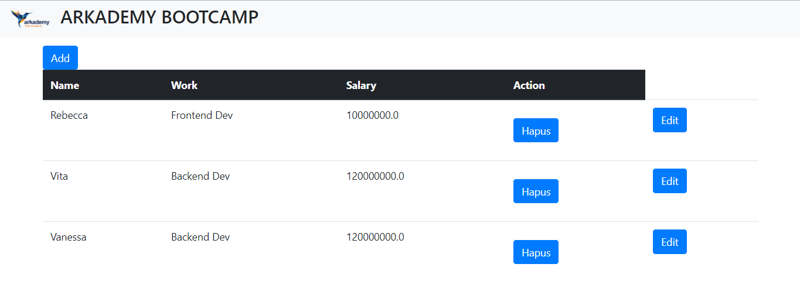
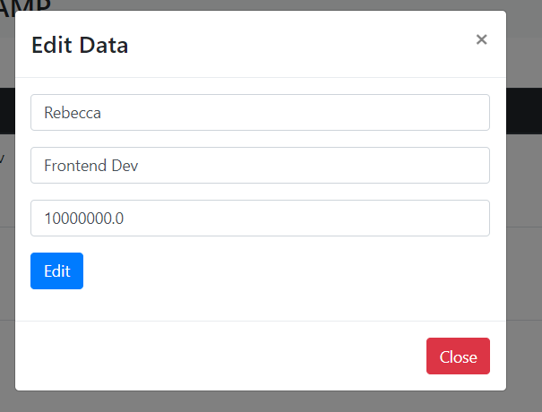
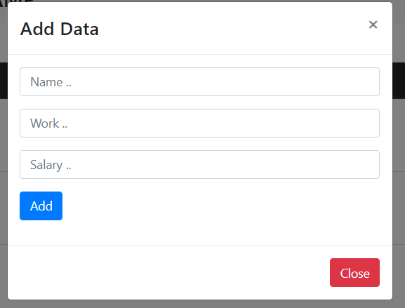

# Petunjuk jawaban test seleksi bootcamp arkademy

## Soal Nomor 1  
nama file : soal1.py 
keterangan :  
bahasa pemrograman menggunakan python3  
library python yang digunakan adalah json untuk dapat melakukan pemrosesan data yang berformat json. 

## Soal Nomor 2  
nama file : soal2.py 
keterangan :  
bahasa pemrograman menggunakan python3  
library python yang digunakan adalah re (regex) untuk dapat melakukan pemrosesan data dalam hal pengubahan bentuk string berdasarkan regex
 

## Soal Nomor 3  
nama file : soal3.py 
keterangan :  
bahasa pemrograman menggunakan python3  
tidak ada library python yang digunakan, hanya menggunakan fungsi bawaan python 

## Soal Nomor 4  
nama file : soal4.py 
keterangan :  
bahasa pemrograman menggunakan python3  
library python yang digunakan adalah re (regex) untuk dapat melakukan pemrosesan data dalam hal pengubahan bentuk string berdasarkan regex
. 

## Soal Nomor 5  
nama file : soal5.py 
keterangan :  
bahasa pemrograman menggunakan python3  
tidak ada library python yang digunakan, hanya menggunakan fungsi bawaan python. 

## Soal Nomor 6  
nama direktori : soal6  
keterangan :  
Menggunakan Framework Flask Python, Install terlebih dahulu python3. 
Lalu install library yang dibutuhkan menggunakan perintah didalam direktori Soal6 :  
<b>pip install -r requirements.txt</b>
Lalu jalankan perintah berikut untuk inisiasi flask (jalankan didalam direktori Soal6) :  
untuk windows cmd :  
set FLASK_APP=script.py  
jalankan flask dengan perintah berikut :  
flask run

untuk unix / macos / linix :  
export FLASK_APP=script.py  
jalakan flask dengan perintah berikut :  
flask run / run flask 

